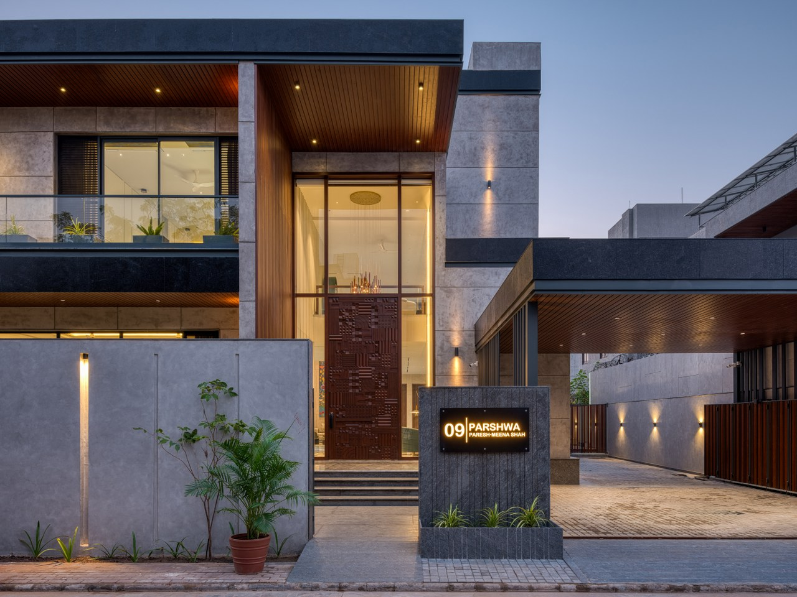

# ** My Dream house to build | This L-Shaped House Design Captures Refreshing Southwesterly Breeze **
  
  
  
Posted On June 2025  
Total Post Views :- <ins>3159</ins>  
Nestled this modern [residence](https://thearchitectsdiary.com/?s=+residence) spans over a 10,881 sq. ft. corner plot, seamlessly integrating form, function, and tranquility. The house is thoughtfully planned in an L-shaped configuration of this house design, with its entry oriented to the east and a lush garden strategically placed in the southwest corner to capture optimal sunlight and the refreshing southwesterly breeze.  
  
**Editor’s Note:** “This modern L-shaped residence redefines luxury and sustainability. Its open-plan design dissolves barriers between indoor and outdoor spaces with expansive verandahs, terraces, and double-height spaces that are timeless yet modern. The use of granite, combined with textured finishes and aluminum panels while providing strength to the structure is grounded in local tradition.  
  
Central to the design is the striking 23’x17’ verandah and its mirrored balcony above, which connect the home’s key spaces, such as the [living room](https://thearchitectsdiary.com/?s=+living+room+), [dining](https://thearchitectsdiary.com/?s=+DINING) area, [kitchen](https://thearchitectsdiary.com/?s=+kitchen), and [bedrooms](https://thearchitectsdiary.com/?s=+bedroom) with large sliding doors that offer uninterrupted views of the garden. Additionally, these transitional spaces serve as the heart of the house. Thus, fostering family gatherings and an intimate connection with nature.   
  
## **Exterior**  
The [architectural](https://thearchitectsdiary.com/category/architecture/) expression emphasizes inward openness, leveraging textures, polished granite, and wooden-coated aluminum accents to create a harmonious facade. This material palette not only adds sophistication but also ensures durability against the local climate.  
  
Designed to embrace natural light and ventilation, this residence is a sanctuary of elegance and comfort, where modernity meets serenity.  
  
The entry to this home is defined by a commanding architectural masterpiece: a 12-foot-long natural wood [entrance door](https://thearchitectsdiary.com/?s=+entrance+door). Additionally, it is adorned with intricately carved modular designs. Moreover, this bespoke door creates an immediate impression of sophistication and artistry, setting the tone for the residence.  
  
## **Entrance Foyer**  
Stepping inside, the grand 27-foot double-height entrance foyer unfolds, featuring elegant Italian flooring in a bold geometric pattern. Adding to the grandeur, an exquisite, vibrant mural spans the height of the wall. Thus, creating a striking interplay of art and architecture. Altogether, these elements establish a space that is both welcoming and awe-inspiring, a true testament to thoughtful design and craftsmanship.  
  
  
## **Living Space**  
As one steps through the entrance foyer, the residence reveals a stunning transition from its modest and discreet facade to a grand hall. Moreover, the double-height formal living and dining area is a breathtaking space, designed to surprise and awe.  
  
Subtle, timeless interiors set the stage, enhanced by curated chandeliers, striking textile painting, and sculptures that add artistic flair. The cantilever staircase, clad in dual-toned Italian marble and accentuated by a sculptural centerpiece below. Additionally, a cascading 35-foot lighting installation stands as a dramatic focal point of the hall.  
  
The formal living and dining areas come together to form a grand central hall, serving as the heart of the home and the epicenter for public interaction. This space acts as a gateway, seamlessly connecting to other rooms, including the grand kitchen. The kitchen is thoughtfully designed for both functionality and accessibility. Additionally, it opens to the garden through sliding doors, linking directly to the verandah. This connection allows for a smooth transition between indoor and outdoor spaces. Thus, making it effortless to enjoy meals in the serene outdoor setting. Additionally, all public and private areas are thoughtfully interlinked through passages, offering easy access to the verandah and balcony, enhancing the sense of openness and a constant connection to the greenery.  
  
## **Informal Living Room **  
Next to the hall is the informal living room, designed with a cozy yet contemporary theme. Moreover, it blends muted tones with modern furniture and textural highlights. This intimate space is thoughtfully curated to encourage family bonding, offering a comforting retreat at the end of the day.  
  
Our stunning 13’ textile painting in the fully white marble-clad puja room.  
Stay updated on Architecture & Interior Design trends   
  
  
First floor lobby passage featuring a library stand in the family area.  
  
## **Bedrooms**  
This elegant residence boasts five unique bedrooms, each designed with a subtle, sophisticated color palette that ensures timeless appeal. Every room showcases a distinct theme, harmonizing furniture and decor in complementary tones. The walls feature geometric paneling, enhanced by a mix of textures including textured paint, PU finishes, and Italian cladding, adding depth and character. Natural light floods each bedroom through expansive sliding glass doors. Additionally, it seamlessly connects the interiors to private verandahs and balconies and fosters a perfect indoor-outdoor living experience.  
  
Son’s bedroom bed wall featuring a PU finish and Italian marble cladding, complemented by cozy furniture  
  
Son’s bedroom study unit bathed in the first rays of morning sunlight.  
  
  
Bedroom 5 featuring a grey lime-wash textured bed wall with modern paneling.  
  
Master bedroom with PU finish flush wall and a blend of red and beige tones.  
  
Master bedroom with a fluted textured wall accented by gold metal, complemented by navy and amber palette furniture.  
  
  
A multipurpose room featuring a big screen and poker table, complemented by dark-toned interiors and vibrant, dynamic furniture  
  
## **Concept **  
The inspiration for this project stems from the timeless principles of modernist architecture, particularly the seamless integration of indoor and outdoor spaces as championed by architectural maestros like Frank Lloyd Wright and Le Corbusier.   
  
  
Drawing from their philosophy of harmonizing built structures with nature, this project adopts an open-plan layout and expansive glazing to blur the boundaries between the interior spaces and the lush garden outside.   
  
  
The L-shaped design, with verandahs and balconies strategically layered, takes cues from vernacular Indian architecture, reinterpreted in a contemporary style.   
  
  
## **Material**  
The focus on materiality, with granite, textured finishes, and aluminum panels, reflects a commitment to creating spaces that are both enduring and contextually grounded, paying homage to architectural traditions while embracing modern minimalism.  
  
  
  
  
